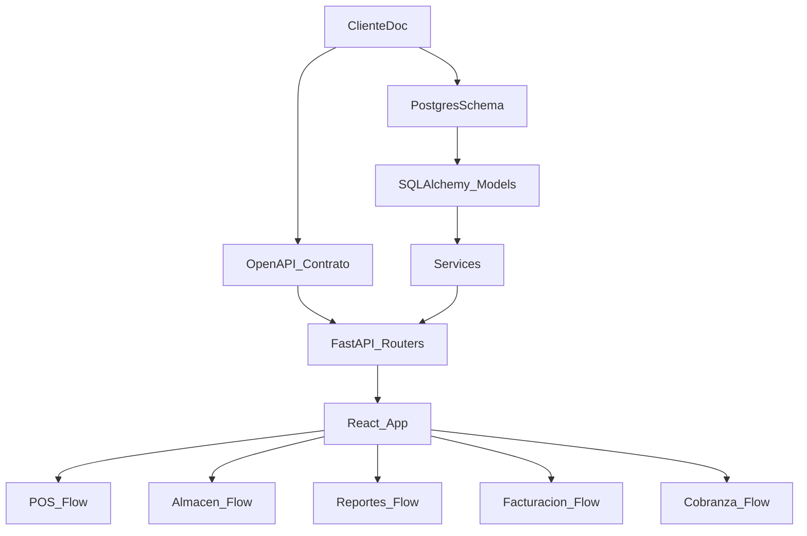

## Veredicto profesional (auditoría)

- **Estado real actual**: hay un backend FastAPI funcional para **login** y un flujo de **ventas** tipo “/sales” con transacciones y locks; y una BD `almacen_db.sql` con tablas/triggers orientados a POS (inventario/ventas/tickets/facturas). Pero el sistema está **desalineado** en tres frentes críticos.

- **Brecha 1 — Modelo de datos (crítica)**: los modelos SQLAlchemy del backend **no coinciden** con `almacen_db.sql`.
  - En `almacen_db.sql`:
    - `inventario.stock` (no `cantidad`), `variantes_producto` tiene `precio_menudeo` y `precio_mayoreo` (no un solo `precio`), `venta_detalle` no tiene `descuento`, `ventas` no tiene `estado/subtotal/descuento/impuesto`.
  - En el backend:
    - `Inventario.cantidad`, `VarianteProducto.precio`, `Venta` con `estado/subtotal/descuento/impuesto`, `VentaDetalle.descuento`.
  - **Impacto**: aunque “compile”, el backend **rompe** al conectar con la BD real.

- **Brecha 2 — Contrato API (crítica)**: `openapi.yaml` está bastante alineado al documento del cliente (rutas `/api/v1/ventas`, `/pos/barcode`, inventario, facturas), pero el backend expone hoy solo:
  - `GET/POST /api/v1/auth/*`
  - `GET/POST /api/v1/sales/*`
  - y **no registra routers** de productos/inventario/facturación/reportes.
  - **Impacto**: el frontend llama endpoints que hoy **no existen** en el backend.

- **Brecha 3 — Requisitos del documento vs. implementación (alta)**
  - **Cubierto parcialmente**:
    - Autenticación JWT y roles básicos.
    - Control de inventario con locks (concepto) y triggers en BD (concepto).
    - Precios menudeo/mayoreo **existe en BD**, pero hoy aplica por “cantidad de línea” (trigger `fn_precio_automatico`) y no por **acumulado por producto en la venta** como pide el documento/contrato.
  - **No cubierto** (principales):
    - POS completo: pantalla de venta, lectura por “RF” (teclado/escáner), flujo de caja, impresión de ticket, QR para facturación.
    - “Programa de cobranza” (ventas a crédito + abonos/saldo).
    - Reportes: ventas (por método pago y facturación), almacén (existencias por tipo), movimientos, general mensual comparativo.
    - Almacén: layout de carga masiva, alta manual de productos, variantes (talla/color), generación de códigos, control centralizado multi-dispositivo.
    - Facturación SAT: integración PAC (timbrado), factura global tarjetas, folios/series.

- **Conclusión**: hoy tienen una **base técnica útil** (estructura Clean-ish, auth, repos, Docker, y una BD que ya trae triggers), pero antes de “seguir desarrollando”, hay que hacer una **fase de alineación** para que BD↔backend↔contrato sean coherentes; si no, cualquier feature nueva acumulará deuda y riesgo de errores.

## Supuestos (alineados al documento)

- La **fuente de verdad** será el **documento del cliente**, y lo materializamos en:
  - API: `openapi.yaml` (ajustándolo donde sea necesario para reflejar el documento exactamente).
  - BD: partimos de `almacen_db.sql` y la extendemos con migraciones controladas.
- Hardware POS:
  - **Lector RF/código de barras** se tratará como “keyboard wedge” (input en campo de código).
  - **Impresión/caja**: se implementa primero como **ticket HTML imprimible** + opción ESC/POS vía servicio local (QZ Tray o app local) en fase posterior.

## Plan de acción (por fases)

### Fase 0 — Congelar contrato y “cerrar brechas” base (imprescindible)

- Revisar y ajustar `openapi.yaml` para que sea el contrato oficial alineado al documento.
- Alinear backend a BD:
  - Decidir y ejecutar estrategia: **adaptar modelos/repositorios** al esquema real de `almacen_db.sql`.
  - Eliminar/ajustar campos que no existen (ej. `descuento` en `venta_detalle`, `estado` en `ventas`) o **extender BD** con migración si el requisito lo exige.
- Registrar routers faltantes en `backend/app/main.py` para productos, inventario, POS, facturas, reportes.

### Fase 1 — POS (ventas en mostrador) 100% operativo

- Implementar flujo POS del documento:
  - Crear venta
  - Escanear código (`GET /pos/barcode/{codigo}`)
  - Agregar ítem (`POST /ventas/{id}/items`) con reglas de stock y precio
  - Cerrar venta (`POST /ventas/{id}/cerrar`) → generar ticket
  - Cancelar venta (`POST /ventas/{id}/cancelar`)
- **Precio menudeo/mayoreo**: implementar la regla correcta “por acumulado por producto en la venta” (documento/contrato).
  - Recomendación: función SQL tipo `fn_agregar_item_venta(venta_id, variante_id, cantidad, usuario_id)` que:
    - valida stock (lock),
    - inserta detalle,
    - recalcula precio por umbral (>=12) considerando acumulado,
    - actualiza totales.
- **Ticket + QR**:
  - Generar ticket (HTML o texto) desde backend.
  - Generar QR en ticket para iniciar/continuar facturación.

### Fase 2 — Almacén (carga, variantes, control centralizado)

- Variantes por producto (talla/color) y carga de precios (menudeo/mayoreo) alineado a `variantes_producto`.
- Carga masiva por layout (CSV/XLSX): endpoint de importación + validaciones.
- Movimientos de inventario (entrada/salida/ajuste) con trazabilidad y roles.
- Stock bajo (mínimos) y alertas.

### Fase 3 — Reportes (ventas/almacén/movimientos/general)

- Endpoints de reportes con filtros por fecha, método de pago, facturado/no facturado.
- Exportación (CSV/PDF) y pantallas en frontend.

### Fase 4 — Cobranza (crédito y abonos)

- Modelo mínimo: clientes + cuentas por cobrar + pagos.
- Integración en POS: venta “a crédito” y posterior liquidación.

### Fase 5 — Facturación SAT (integración PAC)

- Consolidar tablas `facturas`, `factura_ventas`, `folios_sat`.
- Capa “adapter” para PAC (stubs + integración real posterior).
- Factura global de tarjetas.

### Fase 6 — Frontend (experiencia completa)

- Pantalla POS (flujo rápido con lector, teclado, atajos).
- Pantallas de almacén, reportes, facturación y cobranza.
- Manejo de roles (ADMIN/CAJERO/ALMACEN).

## Archivos clave a tocar

- Backend:
  - `[c:\Users\Fernando Acuña\OneDrive\Escritorio\ERP\backend\app\main.py](c:\Users\Fernando Acuña\OneDrive\Escritorio\ERP\backend\app\main.py)` (registrar routers)
  - `[c:\Users\Fernando Acuña\OneDrive\Escritorio\ERP\backend\app\api\v1\ventas.py](c:\Users\Fernando Acuña\OneDrive\Escritorio\ERP\backend\app\api\v1\ventas.py) `(alinear a `/ventas` y endpoints del contrato)
  - Modelos/repositorios/schemas en `backend/app/models/*`, `repositories/*`, `schemas/*` para alineación con BD.
- BD:
  - `[c:\Users\Fernando Acuña\OneDrive\Escritorio\ERP\almacen_db.sql](c:\Users\Fernando Acuña\OneDrive\Escritorio\ERP\almacen_db.sql)` (baseline)
  - Crear carpeta de migraciones/SQL incremental (Alembic o scripts versionados).
- Contrato:
  - `[c:\Users\Fernando Acuña\OneDrive\Escritorio\ERP\openapi.yaml](c:\Users\Fernando Acuña\OneDrive\Escritorio\ERP\openapi.yaml)`
- Frontend:
  - `[c:\Users\Fernando Acuña\OneDrive\Escritorio\ERP\frontend\src\services\apiService.js](c:\Users\Fernando Acuña\OneDrive\Escritorio\ERP\frontend\src\services\apiService.js)` (alinear rutas)
  - Crear páginas POS/Almacén/Reportes.
